# Jobsheet 2
> Nama: Fahridana Ahmad Rayyansyah <br/>
> Absen: 11 <br/>
> Kelas: TI-2F

## Praktikum 1 : Basic Routing
1. **Route /hello**
    ```php
    Route::get('/hello', function () {
        return 'Hello World';
    });
    ```
    > 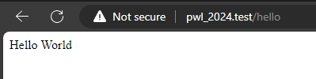
   > 
   > dalam file `web.php`, kita membuat sebuah route untuk `/hello` yang akan mereturn "Hello World", 
   > jadi jika mengakses `/hello`akan memunculkan tulisan "Hello World"
2. **Route /world**
    ```php
    Route::get('/world', function () {
        return 'World';
    });
    ```
    > 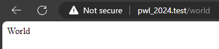
   > 
   > Hal yang sama juga terjadi di sini, sama seperti `/hello` diatas, kita membuat untuk `/world`, 
   > jadi jika kita mengakses `/world` akan menampilkan "World"
3. **Route /**
    ```php
    Route::get('/', function () {
        return 'Selamat Datang';
    });
    ```
    > 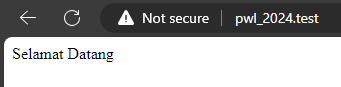
4. **Route /about**
    ```php
    Route::get('/about', function () {
        return '2241720158-Fahridana Ahmad Rayyansyah';
    });
    ```
    > 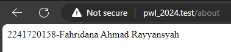


## Praktikum 2 : Route Parameter
1. **Route /user/fahri**
    ```php
    Route::get('/user/{name}', function ($name) {
        return 'Nama saya '.$name;
    });
    ``` 
    > 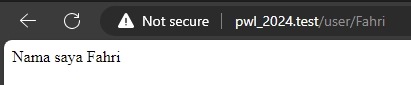
   > 
   > disini terdapat parameter untuk `$name` jadi content yang ada 
   > di web akan berubah sesuai dengan parameter yang ada di url
2. **Route /user**
    > 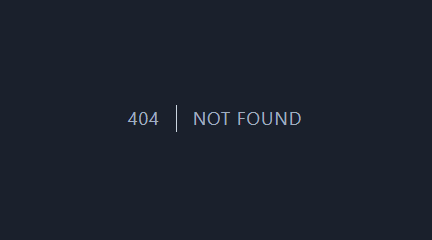
   >
   > terjadi `404 not found` karena memang belum dibuat routing untuk `/user`,
   > kita membuat untuk `/user/{name}` namun tidak membuat `/user` sehingga
   > jika memuat `/user` akan terjadi `404 not found`
   > 
3. **Route /posts/1/comments/5**
    ```php
    Route::get('/posts/{post}/comments/{comment}', function($postId, $commentId) {
        return 'Pos ke-'.$postId." Komentar ke-: ".$commentId;
    });
    ```
    > 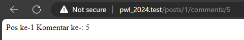
   > 
   > sama seperti no 1, content akan berubah sesuai dengan url yang diketikkan
   > disini `post = 1` dan `comment = 5`, maka akan menampilkan 
   > "Pos ke-1 Komentar ke-: 5", semisal post dan commentnya berubah
   > maka angka pos dan komentar di comment juga akan berubah

4. **Route articles/1**
    ```php
    Route::get('/articles/{id}', function($id) {
        return 'Halaman Artikel dengan ID ' . $id;
   })
    ```
    > 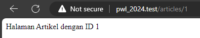

## Praktikum 3 : Optional Parameter
1. **Route /user**
    ```php
    Route::get('/user/{name?}', function ($name=null) {
        return 'Nama saya '.$name;
    });
    ```
   > 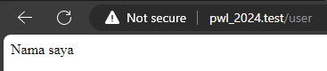
   >
   > Pada kode diatas terdapat optional parameter, dimana tidak wajib untuk menambahkan
sebuah parameter, jadi gambar diatas dengan route `/user` saja tidak masalah, karena `$name`
   jika tidak diisi nilainya otomatis secara default akan null

2. **Route /user/Fahri**
   > 
   >
   > Pada gambar diatas kodenya sama dengan no 1, namun pada url ditambahkan `/Fahri`,
   > dimana itu akan memberikan parameter ke dalam routenya, sehingga terdapat "Fahri"
   > di dalam page tersebut

3. **Route /user**
    ```php
    Route::get('/user/{name?}', function ($name='John') {
        return 'Nama saya '.$name;  
    });
    ```
   > 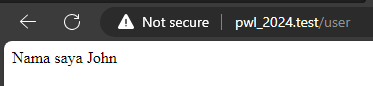
   > 
   > Pada kode diatas kita menambahkan nilai default pada `$name` bernilai John, jadi ketika
   > nilai `$name` tidak diisi, otomatis variabel `$name` akan menjadi John


## Praktikum 4 : Membuat Controller
1. **WelcomeController class**
    ```php
    <?php
    namespace App\Http\Controllers;
    use Illuminate\Http\Request;
   
    class WelcomeController extends Controller{
        public function hello() {
            return 'Hello World';
        }
    }
    ```
   **web.php**
    ```php
   use App\Http\Controllers\WelcomeController;
   
    Route::get(‘/hello’, [WelcomeController::class,’hello’]);
    ```
   **Route /hello**
    > 
   > 
   > Pertama kita membuat sebuah class `WelcomeController.php` dimana merupakan sebuah child
   > dari `Controller`, di dalam class tersebut kita buat sebuah function `hello()` yang akan
   > mengembalikan nilai 'Hello World'. Lalu pada `web.php` kita memanggil class tersebut, dan
   > mengatur route `/hello` sehingga ketika user membuka `/hello` akan memanggil function
   > `hello()` yang ada di class `WelcomeController.php`

2. **HomeController class**
    ```php
    <?php
    namespace App\Http\Controllers;
    use Illuminate\Http\Request;
    
    class HomeController extends Controller{
        public function index() {   
            return 'Selamat Datang';
        }
    }
    ```
   **Route /**
   > 

3. **AboutController class**
    ```php
    <?php
    namespace App\Http\Controllers;
    use Illuminate\Http\Request;
    
    class AboutController extends Controller {
        public function about() {
            return '2241720158-Fahridana Ahmad Rayyansyah';
        }
    }
    ```
   **Route /about**
   > 

4. **AboutController class**
    ```php
    <?php
    namespace App\Http\Controllers;
    use Illuminate\Http\Request;
    
    class ArticleController extends Controller {
        public function articles($articleId) {
            return 'Halaman Artikel dengan ID '.$articleId;
        }
    }
    ```
   **Route /articles/1**
   > 
 

## Praktikum 5 : Resource Controller
**PhotoController class**
```php
<?php
namespace App\Http\Controllers;
use Illuminate\Http\Request;

class PhotoController extends Controller
{
    /**
     * Display a listing of the resource.
     */
    public function index()
    {
        //
    }

    /**
     * Show the form for creating a new resource.
     */
    public function create()
    {
        //
    }

    /**
     * Store a newly created resource in storage.
     */
    public function store(Request $request)
    {
        //
    }

    /**
     * Display the specified resource.
     */
    public function show(string $id)
    {
        //
    }

    /**
     * Show the form for editing the specified resource.
     */
    public function edit(string $id)
    {
        //
    }

    /**
     * Update the specified resource in storage.
     */
    public function update(Request $request, string $id)
    {
        //
    }

    /**
     * Remove the specified resource from storage.
     */
    public function destroy(string $id)
    {
        //
    }
}
```
**web.php**
```php
use App\Http\Controllers\PhotoController;
   
Route::resource('photos', PhotoController::class)->only([
    'index', 'show'
]);
   
Route::resource('photos', PhotoController::class)->except([
    'create', 'store', 'update', 'destroy'
]);
```
**list route**
> 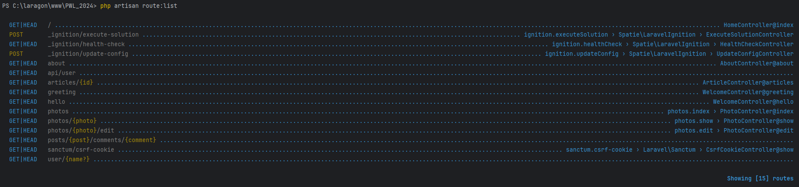


## Praktikum 6 : Membuat View
**hello.blade.php**
```php
<html>
    <body>
        <h1>Hello, {{ $name }}</h1>
    </body>
</html>
```
**web.php**
```php
Route::get('/greeting', function () {
    return view('hello', ['name' => 'Fahri']);
});
```
**route /greeting**
> 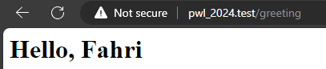
> 
> ketika route /greeting diakses maka akan merender view hello(`hello.blade.php`) dan akan
> mengisi nilai dari variabel `$name` menjadi Fahri sehingga pada halaman web akan terdapat
> "Hello, Fahri"

## Praktikum 7 : View dalam Direktori
**hello.blade.php**
<p>Masih sama seperti praktikum 6</p>

```php
<html>
    <body>
        <h1>Hello, {{ $name }}</h1>
    </body>
</html>
```
**web.php**
```php
Route::get('/greeting', function () {
    return view('blog.hello', ['name' => 'Fahri']);
});
```
**route /greeting**
> 
>
> Hampir mirip dengan praktikum 6 sebelumnya disini bedanya pada peletakan file `hello.blade.php`.
> File `hello.blade.php` diletakkan di dalam folder blog, sehingga untuk mengakses file tersebut
> pada `web.php` perlu menambahkan 'blog.'.

## Praktikum 8 : Menampilkan View dari Controller
**WelcomeController.php**
```php
<?php
namespace App\Http\Controllers;
use Illuminate\Http\Request;

class WelcomeController extends Controller {
    public function hello(){
        return('Hello World');
    }
    
    public function greeting(){
        return view('blog.hello', ['name' => 'Fahri']);
    }
}
```
**web.php**
```php
use App\Http\Controllers\WelcomeController;

Route::get('/greeting', [WelcomeController::class, 'greeting']);
```
**route /greeting**
> 
>
> Disini kita melakukan refactoring dengan memindahkan `view('blog.hello', ['name' => 'Fahri']);` yang awalnya
> di dalam `web.php` sekarang dipindahkan ke `WelcomeController` menjadi function greeting dan di dalam `web.php` akan memanggil function
> `greeting()` yang ada di `WelcomeController.php.` Hasilnya akan tetap sama namun kode akan lebih mudah dimanage


## Praktikum 9 : Meneruskan Data ke View
**WelcomeController.php**
```php
<?php

namespace App\Http\Controllers;

use Illuminate\Http\Request;

class WelcomeController extends Controller
{
    public function hello() {
        return 'Hello World';
    }
    public function greeting(){
        return view('blog.hello')
                    ->with('name', 'Fahri')
                    ->with('occupation', 'Astronout');
    }

}
```
**hello.blade.php**
```php
<html>
    <body>
         <h1>Hello, {{ $name }}</h1>
         <h1>You are {{ $occupation }}</h1>
    </body>
</html>
```
**web.php**
```php
use App\Http\Controllers\WelcomeController;

Route::get('/greeting', [WelcomeController::class, 'greeting']);
```
Route /greeting
> 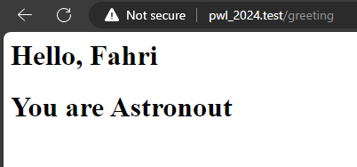
> 
> Pada `WelcomeController` terdapat `with()` function dimana membutuhkan 2 parameter yaitu
> parameter 1 untuk meneruskan nama variabel, di kasus ini variabel `$name` dan `$occupation`
> yang ada di `blog.hello`(merujuk pada `hello.blade.php`) lalu parameter 2 yang merupakan nilai dari variabel tersebut,
> dalam kasus ini `$name = Fahri` dan `$occupation = Astronout`. Nilai nilai ini akan diteruskan ke dalam
> `hello.blade.php` sehingga muncul 'Hello,Fahri You are Astronout' saat mengakses /greeting


## SOAL PRAKTIKUM
Untuk kode dari soal praktikum dapat dilihat [disini](https://github.com/Fahridanaa/POS)
